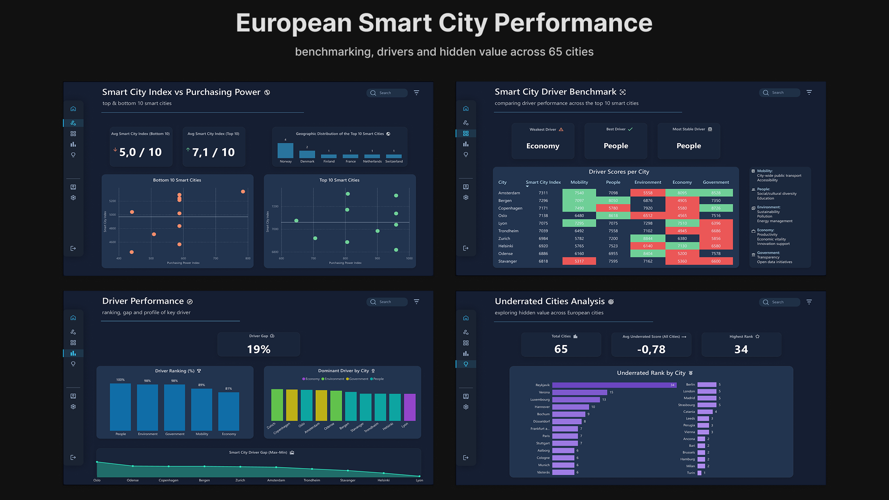

## Hi, I'm Daniel 👋

## 👤 About Me
I'm a Data Analyst who turns raw data into clear, structured insights.  
I focus on clean workflows, reliable analysis and dashboards that explain themselves.

I work with SQL, Python and Power BI, and I care about visual structure, consistency and business understanding.

### 🛠️ Skills & Tools

  <!-- SQL (generic) -->
  

  <!-- Python -->
  

  <!-- Jupyter Notebook -->
  

  <!-- Pandas -->
  

  <!-- NumPy -->
  

  <!-- Plotly -->
  

  <!-- Power BI -->
  

  <!-- Figma (optional) -->
  

  ## 📬 Contacts

## 📂 Projects

  

🔗 [View Project](https://github.com/Dani-s-lab/European-Smart-City-Performance)
